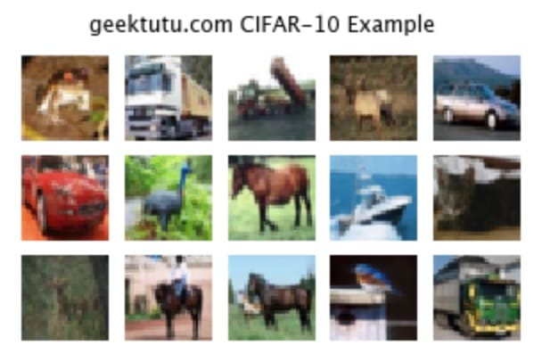
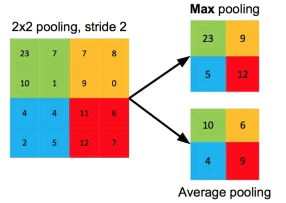

**TF2.0 TensorFlow 2 / 2.0 中文文档：卷积神经网络分类 CIFAR-10 Convolutional Neural Networks**

主要内容：使用卷积神经网络(Convolutional Neural Network, CNN)分类[CIFAT-10数据集](https://www.cs.toronto.edu/~kriz/cifar.html)

官方文档使用的是MNIST数据集，之前在[mnist手写数字识别(CNN卷积神经网络)](https://geektutu.com/post/tensorflow2-mnist-cnn.html)这篇文章中已经有详细的介绍了，包括训练模型、使用真实图片预测等。这篇文章选用 CIFAR-10 数据集来验证简单的卷积神经网络在图像分类问题上的表现。

## CIFAR-10 数据集简介

与 MNIST 手写数字一样，CIFAR-10 包含了60,000张图片，共10类。训练集50,000张，测试集10,000张。但与MNIST不同的是，CIFAR-10 数据集中的图片是彩色的，每张图片的大小是 _32x32x3_ ，3代表 _R/G/B_ 三个通道，每个像素点的颜色由 _R/G/B_ 三个值决定，_R/G/B_ 的取值范围为0-255。熟悉计算机视觉的童鞋应该了解，图片像素点的值还可以由 _R/G/B/A_ 四个值决定，A 代表透明度，取值范围为0-1。比如下面2个颜色，同样是黑色，透明度不同，感官上会有很大差别：

<p style="text-align:center;color:white;background-color:rgba(0,0,0,1);">rgba(0, 0, 0, 1)</p>
<p style="text-align:center;color:white;background-color:rgba(0,0,0,0.5);">rgba(0, 0, 0, 0.5)</p>

下载 CIFAR-10 数据集

```python
# geektutu.com
import matplotlib.pyplot as plt
import tensorflow as tf
from tensorflow.keras import layers, datasets, models

(train_x, train_y), (test_x, test_y) = datasets.cifar10.load_data()
```

看一看前15张图片长啥样吧。

```python
# geektutu.com
plt.figure(figsize=(5, 3))
plt.subplots_adjust(hspace=0.1)
for n in range(15):
    plt.subplot(3, 5, n+1)
    plt.imshow(train_x[n])
    plt.axis('off')
_ = plt.suptitle("geektutu.com CIFAR-10 Example")
```



将0-255的像素值转换到0-1

```python
# geektutu.com
train_x, test_x = train_x / 255.0, test_x / 255.0
print('train_x shape:', train_x.shape, 'test_x shape:', test_x.shape)
# (50000, 32, 32, 3), (10000, 32, 32, 3)
```

## 卷积层

```python
# geektutu.com
model = models.Sequential()
model.add(layers.Conv2D(32, (3, 3), activation='relu', input_shape=(32, 32, 3)))
model.add(layers.MaxPooling2D((2, 2)))
model.add(layers.Conv2D(64, (3, 3), activation='relu'))
model.add(layers.MaxPooling2D((2, 2)))
model.add(layers.Conv2D(64, (3, 3), activation='relu'))
model.summary()
```

```bash
Model: "sequential_1"
_________________________________________________________________
Layer (type)                 Output Shape              Param #   
=================================================================
conv2d_3 (Conv2D)            (None, 30, 30, 32)        896       
_________________________________________________________________
max_pooling2d_2 (MaxPooling2 (None, 15, 15, 32)        0         
_________________________________________________________________
conv2d_4 (Conv2D)            (None, 13, 13, 64)        18496     
_________________________________________________________________
max_pooling2d_3 (MaxPooling2 (None, 6, 6, 64)          0         
_________________________________________________________________
conv2d_5 (Conv2D)            (None, 4, 4, 64)          36928     
=================================================================
Total params: 56,320
Trainable params: 56,320
Non-trainable params: 0
_________________________________________________________________
```

CNN 的输入是三维张量 (image_height, image_width, color_channels)，即 input_shape。每一层卷积层使用`tf.keras.layers.Conv2D`来搭建。Conv2D 共接收2个参数，第2个参数是卷积核大小，第1个参数是卷积核的个数。

关于 CNN 更详细的内容，可以参考[mnist手写数字识别(CNN卷积神经网络)](https://geektutu.com/post/tensorflow2-mnist-cnn.html)，这里有卷积的动态效果图和推荐的视频。

第1、2卷积层后紧跟了最大池化层(MaxPooling2D)，最大池化即选择图像区域的最大值作为该区域池化后的值，另一个常见的池化操作是平均池化，即计算图像区域的平均值作为该区域池化后的值。



每一轮卷积或池化后，图像的宽和高的值都会减小，假设图像的高度为h，卷积核大小为 m，那么很容易得出卷积后的高度 h1 = h - m + 1。池化前的高度为 h1，池化滤波器大小为 s，那么池化后的高度为 h1 / s。对应到`model.summary()`的输出，输入大小为 (32, 32)，经过32个3x3的卷积核卷积后，大小为 (30, 30)，紧接着池化后，大小变为(15, 15)。

## 全连接层

我们的目的是对图像进行分类，即期望输出一个长度为10的一维向量，第k个值代表输入图片分类为k的概率。因此需要通过 Dense 层，即全连接层，将3维的卷积层输出，转换为一维。这里可以使用`tf.keras.layers.Flatten()`。

```python
# geektutu.com
model.add(layers.Flatten())
model.add(layers.Dense(64, activation='relu'))
model.add(layers.Dense(10, activation='softmax'))
model.summary()
```

看一下最终的模型。

```bash
Model: "sequential_1"
_________________________________________________________________
Layer (type)                 Output Shape              Param #   
=================================================================
conv2d_3 (Conv2D)            (None, 30, 30, 32)        896       
_________________________________________________________________
max_pooling2d_2 (MaxPooling2 (None, 15, 15, 32)        0         
_________________________________________________________________
conv2d_4 (Conv2D)            (None, 13, 13, 64)        18496     
_________________________________________________________________
max_pooling2d_3 (MaxPooling2 (None, 6, 6, 64)          0         
_________________________________________________________________
conv2d_5 (Conv2D)            (None, 4, 4, 64)          36928     
_________________________________________________________________
flatten_1 (Flatten)          (None, 1024)              0         
_________________________________________________________________
dense_2 (Dense)              (None, 64)                65600     
_________________________________________________________________
dense_3 (Dense)              (None, 10)                650       
=================================================================
Total params: 122,570
Trainable params: 122,570
Non-trainable params: 0
_________________________________________________________________
```

## 编译训练模型

```python
# geektutu.com
model.compile(optimizer='adam',
              loss='sparse_categorical_crossentropy',
              metrics=['accuracy'])

model.fit(train_x, train_y, epochs=5)
```

## 评估模型

```python
# geektutu.com
test_loss, test_acc = model.evaluate(test_x, test_y)
test_acc # 0.683
```

卷积神经网络非常适合用来处理图像，这个模型如果用来训练 MNIST 手写数字数据集，可以达到 99% 的正确率，但是在 CIFAR10 数据集上，只有 68.3% 的正确率，我们将在后面的文章中，使用复杂网络模型或者迁移学习来提高准确率。

返回[文档首页](https://geektutu.com/post/tf2doc.html)

> 完整代码：[Github - cnn-cifar-10.ipynb](https://github.com/geektutu/tensorflow2-docs-zh/tree/master/code)
> 参考文档：[Convolutional Neural Networks](https://www.tensorflow.org/beta/tutorials/images/intro_to_cnns)