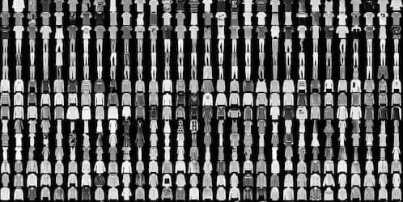

**TF2.0 TensorFlow 2 / 2.0 中文文档 - 图像分类 Classify images**

主要内容：使用神经网络对服饰图片进行分类。

这篇文档使用高级API`tf.keras`在TensorFlow中搭建和训练模型。

```python
# TensorFlow and tf.keras
import tensorflow as tf
from tensorflow import keras

# Helper libraries
import numpy as np
```

## 使用 Fashion MNIST  数据集



Fashion Mnist数据集由70,000张黑白图片构成，每张图片大小为 28x28，由十类服饰图片构成。另一个MNIST数据集是手写数字，Fashion MNIST 与之相比更有挑战性，适合用来验证算法。

我们使用60,000张图片作为训练集，10,000张图片作为测试集。这个数据集可以从 TensorFlow 中直接获取，返回值为numpy数组。

```python
fashion_mnist = keras.datasets.fashion_mnist

(train_images, train_labels), (test_images, test_labels) = fashion_mnist.load_data()
```

图片大小28x28，每个像素值取值范围0-255。标签是整数，取值范围0-9，与实际的服饰类别对应关系如下。

| 标签 | 类别        | 标签 | 类别   | 标签 | 类别    | 标签 | 类别       |
| ---- | ----------- | ---- | ------ | ---- | ------- | ---- | ---------- |
| 0    | T-shirt/top | 3    | Dress  | 6    | Shirt   | 9    | Ankle boot |
| 1    | Trouser     | 4    | Coat   | 7    | Sneaker |      |            |
| 2    | Pullover    | 5    | Sandal | 8    | Bag     |      |            |

## 数据格式

```python
train_images.shape # (60000, 28, 28)
len(train_labels) # 60000
train_labels # ([9, 0, 0, ..., 3, 0, 5], dtype=uint8)
test_images.shape # (10000, 28, 28)
len(test_labels) # 10000
```

## 预处理

训练之前，我们需要对数据进行预处理。图片的每个像素值在0-255之间，需要转为0-1。训练集和测试集都需要经过相同的处理。

```python
train_images = train_images / 255.0
test_images = test_images / 255.0
```

## 搭建模型

神经网络的基本构成是网络层(layer)，大部分深度学习网络都由多个简单的 layers 构成。

```python
model = keras.Sequential([
    keras.layers.Flatten(input_shape=(28, 28)),
    keras.layers.Dense(128, activation='relu'),
    keras.layers.Dense(10, activation='softmax')
])
```

网络的第一层，`Flatten`将输入从28x28 的二维数组转为784的一维数组，这一层的作用仅仅是将每一行值平铺在一行。

接下来是2层`Dense`，即全连接层(fully connected, FC)，第一层`Dense`有128个神经元。第二层有10个神经元，经过 _softmax_ 后，返回了和为1长度为10的概率数组，每一个数分别代表当前图片属于分类0-9的概率。

## 编译模型

模型准备训练前，在模型编译(Compile)时还需要设置一些参数。

- _Loss function_ - 损失函数，训练时评估模型的正确率，希望最小化这个函数，往正确的方向训练模型。
- _Optimizer_ - 优化器算法，更新模型参数的算法。
- _Metrics_  - 指标，用来监视训练和测试步数，下面的例子中使用`accuracy`，即图片被正确分类的比例。

```python
model.compile(optimizer='adam',
              loss='sparse_categorical_crossentropy',
              metrics=['accuracy'])
```

## 训练模型

训练神经网络，通常有以下几个步骤。

- 传入训练数据，`train_images`和`train_labels`。
- 训练模型去关联图片和标签。
- 模型对测试集`test_images`作预测，并用`test_labels`验证预测结果。

使用`model.fit`函数开始训练。

```python
model.fit(train_images, train_labels, epochs=10)
```

```bash
Train on 60000 samples
Epoch 1/10
60000/60000 [========] - 4s 70us/sample - loss: 0.5032 - accuracy: 0.8234
Epoch 2/10
60000/60000 [========] - 4s 64us/sample - loss: 0.3793 - accuracy: 0.8618
...
Epoch 10/10
60000/60000 [========] - 4s 66us/sample - loss: 0.2389 - accuracy: 0.9115
```

最终达到了88%左右的准确率。


## 评估准确率

接下来，看看在测试集中表现如何？

```python
test_loss, test_acc = model.evaluate(test_images, test_labels)
print('\nTest accuracy:', test_acc)
# 10000/10000 [========] - 0s 37us/sample - loss: 0.3610 - accuracy: 0.8777
# Test accuracy: 0.8777
```

测试集的准确率低于训练集，训练集和测试集准确率之间的差距代表模型_过拟合_(_overfitting_)。即对于训练中没有见过的新数据，模型表现差。

## 预测

使用`predict`函数进行预测。

```python
predictions = model.predict(test_images)
predictions[0]
```

看下第一张图片的预测结果。

```bash
array([1.06-05, 5.06-12, 8.44-08, 4.09-09, 2.87-07, 2.28-04, 
       6.18-06, 2.48-02, 3.81-06, 9.74-01], dtype=float32)
```

每次预测返回长度为10的数组，代表属于每一种分类的可能性，最大可能性的label是9。测试集中的数据也是9，预测正确。

```python
np.argmax(predictions[0]) # 9
test_labels[0] # 9
```

返回[文档首页](https://geektutu.com/post/tf2doc.html)

> 参考地址：[Train your first neural network: basic classification](https://www.tensorflow.org/beta/tutorials/keras/basic_classification)
