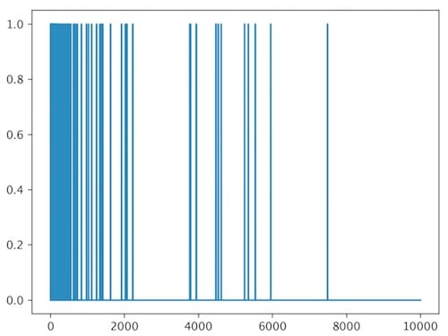
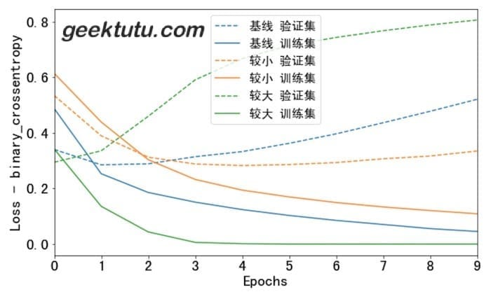
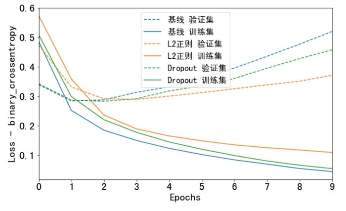

**TF2.0 TensorFlow 2 / 2.0 中文文档：过拟合与欠拟合 Explore overfitting and underfitting**


主要内容：探索正则化(weight regularization)和 dropout 两种避免过拟合的方式改善 IMDB 影评分类效果。

之前不管是对影评数据分类，还是预测燃油效率，都可以看到模型在验证集的准确率会在训练一段时间后达到顶峰，之后开始下降。

换句话说，过拟合了。在训练集上达到较高的准确率是容易的，但我们的目的是在测试集，即模型没有见过的数据集上表现良好。

过拟合的反面是欠拟合。即对于测试数据还存在改进的空间。通常由如下原因导致：

- 模型不够好。
- 过度正则化(over-regularized)
- 训练时间过短。

这些都意味着模型没有学习到训练数据的特征。

如果训练太久，模型可能开始过拟合，导致在测试集上表现不佳，因此我们需要取得一个平衡。


## IMDB 数据集

我们这次采用 `multi-hot encoding`的方式处理 IMDB 数据集，这样能快速达到过拟合的效果。multi-hot 的方式很简单，给每一个单词一个编号，每句话用长度为10,000的一维向量表示，将出现单词的位置置为1即可。

```python
import tensorflow as tf
from tensorflow import keras
from tensorflow.keras.datasets import imdb

import numpy as np
import matplotlib.pyplot as plt

# 解决中文乱码问题
plt.rcParams['font.sans-serif'] = ['SimHei']
plt.rcParams['axes.unicode_minus'] = False
plt.rcParams['font.size'] = 20

N = 10000

def multi_hot_encoding(sentences, dim=10000):
    results = np.zeros((len(sentences), dim))
    for i, word_indices in enumerate(sentences):
        results[i, word_indices] = 1.0
    return results


(train_x, train_y), (test_x, test_y) = imdb.load_data(num_words=N)
train_x = multi_hot_encoding(train_x)
test_x = multi_hot_encoding(test_x)

plt.plot(train_x[0])
plt.show()
```


如果出现这样的错误，[SSL: CERTIFICATE_VERIFY_FAILED] certificate verify failed: unable to get local issuer certificate (_ssl.c:1045)，解决办法可以参考 [Github - google-images-download](https://github.com/hardikvasa/google-images-download/issues/140)

## 过拟合

防止过拟合最简单的方式是降低模型复杂度，比如减少模型的学习参数(learnable parameters)。减少神经网络的层数，减少每一层网络的节点数都能达到目的。在深度学习中，学习参数的数量往往代表了模型“容量”(capacity)。容量越大，记忆能力越强，更容易学习到训练集的特征和标签的映射关系，类似于字典。如果这种映射关系缺乏泛化能力，在测试集上不可能有好的表现。

训练的目的不是为了让模型完全拟合训练数据，而是为了训练出具有泛化能力的模型。

反过来，如果模型较小，记忆能力较弱，学习映射关系比较困难。为了最小化损失(loss)，模型需要压缩学习到的东西，因而具备更好的预测能力。但是，如果模型过小，没有足够的神经元记住有用的信息，训练会非常困难。因此需要取得权衡。

如何选择合适的网络层数和神经元数量呢？没有公式，只能不断尝试。

为了确定合适的模型大小，建议一开始采用一个参数少的模型，然后逐渐增大，直到验证集的损失(loss)基本不再变化。我们用之前的 IMDB 影评分类模型来试一试。

先搭一个基线模型，再创建大、小2个模型比较。

```python
def build_and_train(hidden_dim, regularizer=None, dropout=0):
    model = keras.Sequential([
        keras.layers.Dense(hidden_dim, activation='relu', 
                           input_shape=(N,),
                           kernel_regularizer=regularizer),
        keras.layers.Dropout(dropout),
        keras.layers.Dense(hidden_dim, activation='relu',
                           kernel_regularizer=regularizer),
        keras.layers.Dropout(dropout),
        keras.layers.Dense(1, activation='sigmoid')
    ])

    model.compile(optimizer='adam', loss='binary_crossentropy',
                  metrics=['accuracy', 'binary_crossentropy'])
    history = model.fit(train_x, train_y, epochs=10, batch_size=512,
                        validation_data=(test_x, test_y), verbose=0)

    return history


baseline_history = build_and_train(16)
smaller_history = build_and_train(4)
larger_history = build_and_train(512)
```

我们画图看一看这三个模型在训练集和验证集上的表现。

```python
def plot_history(histories, key='binary_crossentropy'):
    plt.figure(figsize=(10, 6))

    for name, history in histories:
        val = plt.plot(history.epoch, history.history['val_'+key],
                       '--', label=name + ' 验证集')
        plt.plot(history.epoch, history.history[key], 
                 color=val[0].get_color(), label=name + ' 训练集')

    plt.xlabel('Epochs')
    plt.ylabel('Loss - ' + key)
    plt.legend()

    plt.xlim([0, max(history.epoch)])

plot_history([('基线', baseline_history),
              ('较小', smaller_history),
              ('较大', larger_history)])
```



大的模型在第一波(epoch)训练后，就已经过拟合了。模型容量越大，就会越快地拟合训练数据，虽然训练集损失(loss)很低，但事实上已经过拟合了，验证集的loss明显大于训练集。

## 如何防止过拟合

### 权重正则化

> 如果关于同一个问题有许多种理论，每一种都能作出同样准确的预言，那么应该挑选其中使用假定最少的。尽管越复杂的方法通常能做出越好的预言，但是在结果大致相同的情况下，假设越少越好。    ---- 维基百科《奥卡剃须刀》

你可能听说过奥卡剃须刀原则——如无必要，勿增实体。将这个原则应用到神经网络模型，相同的预测能力下，优选简单的模型，比起复杂的模型，简单的模型不容易过拟合。

将模型变简单，除了将模型变小（减少网络层数和每层神经元个数）以外，还有另一种方式，减小模型权重(w)的熵(entropy)。即限制权重值在一个较小的范围内，这样模型中权重分布看起来更“regular”，这被称为“权重正则化”(weight regularization)。常用**L1正则化**和**L2正则化**2种方式，L2 正则化更通用。

> 正则化建议参考：[机器学习中常常提到的正则化到底是什么意思？](https://www.zhihu.com/question/20924039)

### Dropout

在神经网络中，Dropout是最有效的以及使用最广泛的正则化方式。Dropout作用在网络层，训练过程中随机丢弃(dropping out)一部分输出值（例如置为0），Dropout的比例一般置为0.2到0.5之间。例如：

```python
[0.2, 0.3, 0.5, 0.7, 0.9]
# after 40% dropout
[0.2, 0, 0.5, 0.7, 0]
```

看看效果吧。

```python
l2_model_history = build_and_train(16, keras.regularizers.l2(0.001))
dpt_model_history = build_and_train(16, dropout=0.2)
plot_history([('基线', baseline_history),
              ('L2正则', l2_model_history),
              ('Dropout', dpt_model_history)])
```

)

返回[文档首页](https://geektutu.com/post/tf2doc.html)

> 完整代码：[Github - explore_imdb_overfit.ipynb](https://github.com/geektutu/tensorflow2-docs-zh/tree/master/code)
> 参考文档：[Explore overfitting and underfitting](https://www.tensorflow.org/beta/tutorials/keras/overfit_and_underfit)


