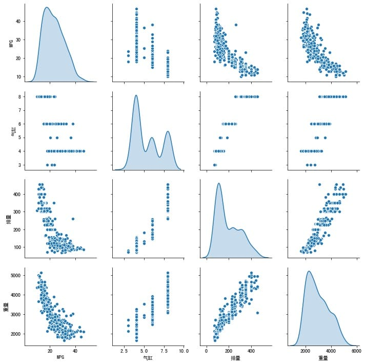
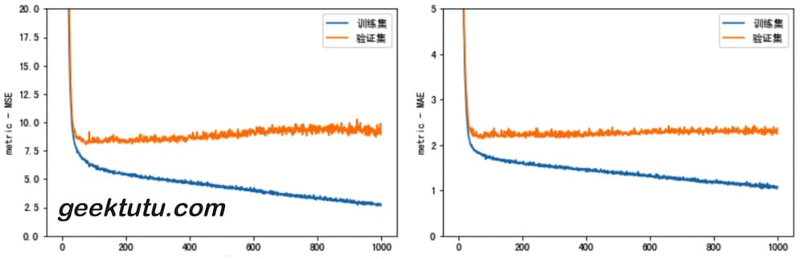
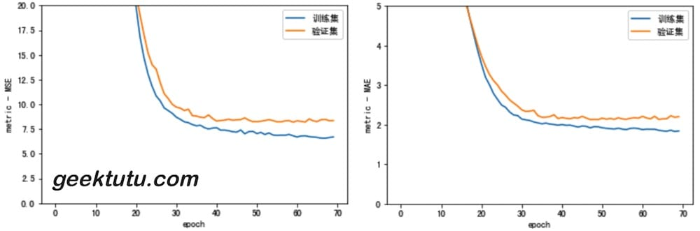
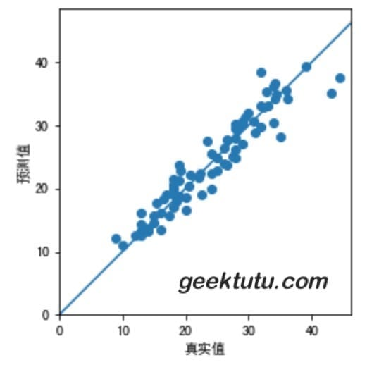

**TensorFlow 2 / 2.0 文档：Regression 回归**

主要内容：使用回归预测烟油效率。

回归通常用来预测连续值，比如价格和概率。分类问题不一样，类别是固定的，目的是判断属于哪一类。比如给你一堆猫和狗的图片，判断一张图片是猫还是狗就是一个典型的分类问题。

接下来使用的是经典的 [Auto MPG](https://archive.ics.uci.edu/ml/datasets/auto+mpg) 数据集，这个数据集包括气缸(cylinders)，排量(displayment)，马力(horsepower) 和重量(weight)等属性。我们需要利用这些属性搭建模型，预测汽车的燃油效率(fuel efficiency)。

模型搭建使用`tf.keras` API。

```python
import pathlib

import matplotlib.pyplot as plt
import pandas as pd
import seaborn as sns
import tensorflow as tf
from tensorflow import keras
from tensorflow.keras import layers
```


## Auto MPG 数据集

### 获取数据

```python
# 下载数据集到本地
url = "http://archive.ics.uci.edu/ml/machine-learning-databases/auto-mpg/auto-mpg.data"
dataset_path = keras.utils.get_file("auto-mpg.data", url)

# 使用Pandas读取数据
column_names = ['MPG','气缸','排量','马力','重量','加速度', '年份', '产地']
raw_dataset = pd.read_csv(dataset_path, names=column_names,
                      na_values = "?", comment='\t',
                      sep=" ", skipinitialspace=True)

dataset = raw_dataset.copy()
# 查看前3条数据
dataset.head(3)
```

|      |  MPG | 气缸 |  排量 |  马力 |   重量 | 加速度 | 年份 | 产地 |
| ---: | ---: | ---: | ----: | ----: | -----: | -----: | ---: | ---: |
|    0 | 18.0 |    8 | 307.0 | 130.0 | 3504.0 |   12.0 |   70 |    1 |
|    1 | 15.0 |    8 | 350.0 | 165.0 | 3693.0 |   11.5 |   70 |    1 |
|    2 | 18.0 |    8 | 318.0 | 150.0 | 3436.0 |   11.0 |   70 |    1 |

### 清洗数据

检查是否有 NA 值。

```python
dataset.isna().sum()
```

```bash
MPG    0
气缸     0
排量     0
马力     6
重量     0
加速度    0
年份     0
产地    0
dtype: int64
```

直接去除含有NA值的行（马力）

```python
dataset = dataset.dropna()
```

在获取的数据集中，`Origin`(产地)不是数值类型，需转为独热编码。

```python
origin = dataset.pop('产地')
dataset['美国'] = (origin == 1)*1.0
dataset['欧洲'] = (origin == 2)*1.0
dataset['日本'] = (origin == 3)*1.0
# 看一看转换后的结果
dataset.head(3)
```

|      |  MPG | 气缸 |  排量 |  马力 |   重量 | 加速度 | 年份 | 美国 | 欧洲 | 日本 |
| ---: | ---: | ---: | ----: | ----: | -----: | -----: | ---: | ---: | ---: | ---: |
|    0 | 18.0 |    8 | 307.0 | 130.0 | 3504.0 |   12.0 |   70 |  1.0 |  0.0 |  0.0 |
|    1 | 15.0 |    8 | 350.0 | 165.0 | 3693.0 |   11.5 |   70 |  1.0 |  0.0 |  0.0 |
|    2 | 18.0 |    8 | 318.0 | 150.0 | 3436.0 |   11.0 |   70 |  1.0 |  0.0 |  0.0 |

### 划分训练集与测试集

```python
# 训练集 80%， 测试集 20%
train_dataset = dataset.sample(frac=0.8, random_state=0)
test_dataset = dataset.drop(train_dataset.index)
```

### 检查数据

快速看一看训练集中属性两两之间的关系吧。

```python
# 解决中文乱码问题
plt.rcParams['font.sans-serif']=['SimHei']
plt.rcParams['axes.unicode_minus']=False

sns.pairplot(train_dataset[["MPG", "气缸", "排量", "重量"]], diag_kind="kde")
```

> matplotlib 中文乱码看这里：[matplotlib图例中文乱码?](https://www.zhihu.com/question/25404709)



你还可以使用`train_dataset.describle()`快速浏览每一属性的平均值、标准差、最小值、最大值等信息，能够帮助你快速地识别出不合理的数据。

```python
train_stats = train_dataset.describe()
train_stats.pop("MPG")
train_stats = train_stats.transpose()
train_stats
```

|      | count |       mean |        std |  min |    25% |   50% |    75% |   max |
| ---: | ----: | ---------: | ---------: | ---: | -----: | ----: | -----: | ----: |
| 气缸 | 314.0 |   5.477707 |   1.699788 |  3.0 |   4.00 |   4.0 |   8.00 |   8.0 |
| 排量 | 314.0 | 195.318471 | 104.331589 | 68.0 | 105.50 | 151.0 | 265.75 | 455.0 |
|  ... |   ... |        ... |        ... |  ... |    ... |  .... |    ... |   ... |

### 分离 label

```python
# 分离 label
train_labels = train_dataset.pop('MPG')
test_labels = test_dataset.pop('MPG')
```

### 归一化数据

通常训练前需要归一化数据，不同属性使用的计量单位不一样，值的范围不一样，训练就会很困难。比如其中一个属性的范围是[0.1, 0.5]，而另一个属性的范围是[1000, 5000]，那数值大的属性就容易对训练产生干扰，很可能导致训练不能收敛，或者是数值小的属性在模型中几乎没有发挥作用。归一化将不同范围的数据映射到[0,1]的空间内，可以有效地避免这个问题。

```python
def norm(x):
  return (x - train_stats['mean']) / train_stats['std']
normed_train_data = norm(train_dataset)
normed_test_data = norm(test_dataset)
```

## 模型

### 搭建模型

我们的模型包含2个全连接的隐藏层构成，输出层返回一个连续值。

```python
def build_model():
  input_dim = len(train_dataset.keys())
  model = keras.Sequential([
    layers.Dense(64, activation='relu', input_shape=[input_dim,]),
    layers.Dense(64, activation='relu'),
    layers.Dense(1)
  ])

  model.compile(loss='mse', metrics=['mae', 'mse'],
                optimizer=tf.keras.optimizers.RMSprop(0.001))
  return model

model = build_model()
# 打印模型的描述信息，每一层的大小、参数个数等
model.summary()
```

```python
Model: "sequential_1"
_________________________________________________________________
Layer (type)                 Output Shape              Param #   
=================================================================
dense_4 (Dense)              (None, 64)                640       
_________________________________________________________________
dense_5 (Dense)              (None, 32)                2080      
_________________________________________________________________
dense_6 (Dense)              (None, 1)                 33        
=================================================================
Total params: 2,753
Trainable params: 2,753
Non-trainable params: 0
_________________________________________________________________
```

### 训练模型

在之前的案例，比如[结构化数据分类](https://geektutu.com/post/tf2doc-ml-basic-structured-data.html)，我们调用`model.fit`会打印出训练的进度。我们可以禁用默认的行为，并自定义训练进度条。

```python
import sys

    
EPOCHS = 1000

class ProgressBar(keras.callbacks.Callback):
  def on_epoch_end(self, epoch, logs):
    # 显示进度条
    self.draw_progress_bar(epoch + 1, EPOCHS)

  def draw_progress_bar(self, cur, total, bar_len=50):
    cur_len = int(cur / total * bar_len)
    sys.stdout.write("\r")
    sys.stdout.write("[{:<{}}] {}/{}".format("=" * cur_len, bar_len, cur, total))
    sys.stdout.flush()

history = model.fit(
  normed_train_data, train_labels,
  epochs=EPOCHS, validation_split = 0.2, verbose=0,
  callbacks=[ProgressBar()])
```

```bash
[==================================================] 1000/1000
```

训练过程都存储在了`history`对象中，我们可以借助 matplotlib 将训练过程可视化。

```python
hist = pd.DataFrame(history.history)
hist['epoch'] = history.epoch
hist.tail(3)
```

| loss |      mae |      mse | val_loss |  val_mae |  val_mse |    epoch |      |
| ---: | -------: | -------: | -------: | -------: | -------: | -------: | ---- |
|  997 | 3.132053 | 1.142280 | 3.132053 | 9.711935 | 2.361466 | 9.711935 | 997  |
|  998 | 3.021109 | 1.093424 | 3.021109 | 9.488593 | 2.298264 | 9.488593 | 998  |
|  999 | 3.028849 | 1.132241 | 3.028849 | 9.453931 | 2.275017 | 9.453931 | 999  |

```python
def plot_history(history):
  hist = pd.DataFrame(history.history)
  hist['epoch'] = history.epoch
  plt.figure()
  plt.xlabel('epoch')
  plt.ylabel('metric - MSE')
  plt.plot(hist['epoch'], hist['mse'], label='训练集')
  plt.plot(hist['epoch'], hist['val_mse'], label = '验证集')
  plt.ylim([0, 20])
  plt.legend()
  
  plt.figure()
  plt.xlabel('epoch')
  plt.ylabel('metric - MAE')
  plt.plot(hist['epoch'], hist['mae'], label='训练集')
  plt.plot(hist['epoch'], hist['val_mae'], label = '验证集')
  plt.ylim([0, 5])
  plt.legend()
  
plot_history(history)
```



从图中，我们可以看到，从100 epoch开始，训练集的loss仍旧继续降低，但验证集的loss却在升高，说明过拟合了，训练应该早一点结束。接下来，我们使用 `keras.callbacks.EarlyStopping`，每一波(epoch)训练结束时，测试训练情况，如果训练不再有效果（验证集的loss，即val_loss 不再下降），则自动地停止训练。

```python
model = build_model()
early_stop = keras.callbacks.EarlyStopping(monitor='val_loss', patience=10)
history = model.fit(normed_train_data, train_labels, epochs=EPOCHS,
                    validation_split = 0.2, verbose=0, 
                    callbacks=[early_stop, ProgressBar()])
plot_history(history)
```

```bash
[===                                               ] 70/1000
```

在第 70 epoch 时，停止了训练。



接下来使用测试集来评估训练效果。

```python
loss, mae, mse = model.evaluate(normed_test_data, test_labels, verbose=0)
print("测试集平均绝对误差(MAE): {:5.2f} MPG".format(mae))
# 测试集平均绝对误差(MAE):  1.90 MPG
```

从图中我们也可以看出，1.9比验证集还略低一点。

## 预测

最后，我们使用测试集中的数据来预测 MPG 值。

```python
test_pred = model.predict(normed_test_data).flatten()

plt.scatter(test_labels, test_pred)
plt.xlabel('真实值')
plt.ylabel('预测值')
plt.axis('equal')
plt.axis('square')
plt.xlim([0,plt.xlim()[1]])
plt.ylim([0,plt.ylim()[1]])
plt.plot([-100, 100], [-100, 100])
```

看起来，模型训练得还不错。




## 结论

-  均方误差(Mean Squared Error, MSE) 常作为回归问题的损失函数(loss function)，与分类问题不太一样。
- 同样，评价指标(evaluation metrics)也不一样，分类问题常用准确率(accuracy)，回归问题常用平均绝对误差 (Mean Absolute Error, MAE)
- 每一列数据都有不同的范围，每一列，即每一个feature的数据需要分别缩放到相同的范围。常用归一化的方式，缩放到[0, 1]。
- 如果训练数据过少，最好搭建一个隐藏层少的小的神经网络，避免过拟合。
- 早停法(Early Stoping)也是防止过拟合的一种方式。

返回[文档首页](https://geektutu.com/post/tf2doc.html)

> 完整代码：[Github - auto_mpg_regression.ipynb](https://github.com/geektutu/tensorflow2-docs-zh/tree/master/code)
> 参考文档：[Regression: Predict fuel efficiency](https://www.tensorflow.org/beta/tutorials/keras/basic_regression)