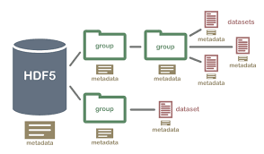

<style>
@media (min-width: 992px) {.gkt-article-start + p > img {min-height: 10rem;}}
.gkt-article-start + p > img {width: auto;}
</style>

**TF2.0 TensorFlow 2 / 2.0 中文文档：保存与加载模型 Save and Restore model**

主要内容：使用 `tf.keras`接口训练、保存、加载模型，数据集选用 MNIST 。

```bash
$ pip install -q tensorflow==2.0.0-beta1
$ pip install -q h5py pyyaml
```

## 准备训练数据

```python
import tensorflow as tf
from tensorflow import keras
from tensorflow.keras import datasets, layers, models, callbacks
from tensorflow.keras.datasets import mnist

import os
file_path = os.path.abspath('./mnist.npz')

(train_x, train_y), (test_x, test_y) = datasets.mnist.load_data(path=file_path)
train_y, test_y = train_y[:1000], test_y[:1000]
train_x = train_x[:1000].reshape(-1, 28 * 28) / 255.0
test_x = test_x[:1000].reshape(-1, 28 * 28) / 255.0
```

## 搭建模型

```python
def create_model():
    model = models.Sequential([
        layers.Dense(512, activation='relu', input_shape=(784,)),
        layers.Dropout(0.2),
        layers.Dense(10, activation='softmax')
    ])

    model.compile(optimizer='adam', metrics=['accuracy'],
                  loss='sparse_categorical_crossentropy')

    return model

def evaluate(target_model):
    _, acc = target_model.evaluate(test_x, test_y)
    print("Restore model, accuracy: {:5.2f}%".format(100*acc))
```

## 自动保存 checkpoints

这样做，一是训练结束后得到了训练好的模型，使用得不必再重新训练，二是训练过程被中断，可以从断点处继续训练。

设置`tf.keras.callbacks.ModelCheckpoint`回调可以实现这一点。

```python
# 存储模型的文件名，语法与 str.format 一致
# period=10：每 10 epochs 保存一次
checkpoint_path = "training_2/cp-{epoch:04d}.ckpt"
checkpoint_dir = os.path.dirname(checkpoint_path)
cp_callback = callbacks.ModelCheckpoint(
    checkpoint_path, verbose=1, save_weights_only=True, period=10)

model = create_model()
model.save_weights(checkpoint_path.format(epoch=0))
model.fit(train_x, train_y, epochs=50, callbacks=[cp_callback],
          validation_data=(test_x, test_y), verbose=0)
```

```python
Epoch 00010: saving model to training_2/cp-0010.ckpt
Epoch 00020: saving model to training_2/cp-0020.ckpt
Epoch 00030: saving model to training_2/cp-0030.ckpt
Epoch 00040: saving model to training_2/cp-0040.ckpt
Epoch 00050: saving model to training_2/cp-0050.ckpt
```

加载权重：

```python
latest = tf.train.latest_checkpoint(checkpoint_dir)
# 'training_2/cp-0050.ckpt'
model = create_model()
model.load_weights(latest)
evaluate(model)
```

```bash
1000/1000 [===] - 0s 90us/sample - loss: 0.4703 - accuracy: 0.8780
Restore model, accuracy: 87.80%
```

## 手动保存权重

```python
# 手动保存权重
model.save_weights('./checkpoints/mannul_checkpoint')
model = create_model()
model.load_weights('./checkpoints/mannul_checkpoint')
evaluate(model)
```

```python
1000/1000 [===] - 0s 90us/sample - loss: 0.4703 - accuracy: 0.8780
Restore model, accuracy: 87.80%
```

## 保存整个模型

上面的示例仅仅保存了模型中的权重(weights)，模型和优化器都可以一起保存，包括权重(weights)、模型配置(architecture)和优化器配置(optimizer configuration)。这样做的好处是，当你恢复模型时，完全不依赖于原来搭建模型的代码。

保存完整的模型有很多应用场景，比如在浏览器中使用 TensorFlow.js 加载运行，比如在移动设备上使用 TensorFlow Lite 加载运行。

### HDF5

直接调用`model.save`即可保存为 HDF5 格式的文件。

```python
model.save('my_model.h5')
```

从 HDF5 中恢复完整的模型。

```python
new_model = models.load_model('my_model.h5')
evaluate(new_model)
```

```bash
1000/1000 [===] - 0s 90us/sample - loss: 0.4703 - accuracy: 0.8780
Restore model, accuracy: 87.80%
```

### saved_model

保存为`saved_model`格式。

```python
import time
saved_model_path = "./saved_models/{}".format(int(time.time()))
tf.keras.experimental.export_saved_model(model, saved_model_path)
```

恢复模型并预测

```python
new_model = tf.keras.experimental.load_from_saved_model(saved_model_path)
model.predict(test_x).shape
```

```bash
(1000, 10)
```

`saved_model`格式的模型可以直接用来预测(predict)，但是 saved_model 没有保存优化器配置，如果要使用`evaluate`方法，则需要先 compile。

```python
new_model.compile(optimizer=model.optimizer,
                  loss='sparse_categorical_crossentropy',
                  metrics=['accuracy'])
evaluate(new_model)
```

```bash
1000/1000 [===] - 0s 90us/sample - loss: 0.4703 - accuracy: 0.8780
Restore model, accuracy: 87.80%
```

## 最后

TensorFlow 中还有其他的方式可以保存模型。

- [Saving in eager](https://www.tensorflow.org/guide/eager#object_based_saving) eager 模型保存模型
- [Save and Restore](https://www.tensorflow.org/guide/saved_model) -- low-level 的接口。

返回[文档首页](https://geektutu.com/post/tf2doc.html)

> 完整代码：[Github - save_restore_model.ipynb](https://github.com/geektutu/tensorflow2-docs-zh/tree/master/code)
> 参考文档：[Save and restore models](https://www.tensorflow.org/beta/tutorials/keras/save_and_restore_models)

## 附 推荐

- [一篇文章入门 Python](https://geektutu.com/post/quick-python.html)