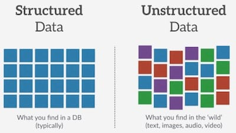

**TF2.0 TensorFlow 2 / 2.0 中文文档 - 结构化数据分类 Classify structured data**

主要内容：介绍如何对结构化数据（例如 CSV 中的表格数据）分类。

这个教程包含完整的代码：

- 使用 Pandas 加载 CSV 文件。
- 使用 tf.data 打乱数据并获取batch。
- 使用特征工程(feature columns)将 CSV 中的列映射为特征值(features)
- 使用 Keras 搭建、训练和评估模型。

## 数据集

数据集由 Cleveland Clinic Foundation 提供的几百行心脏病数据构成。每一行代表一个病人，每一列描述一个属性，数据共14列，最后一列为是否患病。我们将使用这些信息预测一个病人是否有心脏病。这是一个典型的二分分类问题。

| 列     | 描述                                                | 特征类型 | 数据类型 |
| ------ | --------------------------------------------------- | -------- | -------- |
| Age    | 年龄                                                | 数值     | integer  |
| Sex    | 性别(1男性； 0女性)                                 | 类别     | integer  |
| ...    | ...                                                 | ...      | ...      |
| Thal   | 3 = normal; 6 = fixed defect; 7 = reversable defect | 类别     | string   |
| Target | 是否感染，(1是；0否)                                | 分类     | integer  |

## 导入库

```bash
pip install -q sklearn
pip install -q tensorflow==2.0.0-beta1
```

```python
import numpy as np
import pandas as pd
import tensorflow as tf

from tensorflow import feature_column
from tensorflow.keras import layers
from sklearn.model_selection import train_test_split
```

## 使用 Pandas 读取数据

```python
URL = 'https://storage.googleapis.com/applied-dl/heart.csv'
dataframe = pd.read_csv(URL)
dataframe.head()
```

| -    | age  | sex  | cp   | …    | slope | ca   | thal       | target |
| ---- | ---- | ---- | ---- | ---- | ----- | ---- | ---------- | ------ |
| 0    | 63   | 1    | 1    |      | 3     | 0    | fixed      | 0      |
| 1    | 67   | 1    | 4    |      | 2     | 3    | normal     | 1      |
| 2    | 67   | 1    | 4    |      | 2     | 2    | reversible | 0      |
| 3    | 37   | 1    | 3    |      | 3     | 0    | normal     | 0      |
| 4    | 41   | 0    | 2    |      | 1     | 0    | normal     | 0      |

## 分割训练集、验证集和测试集

```python
train, test = train_test_split(dataframe, test_size=0.2)
train, val = train_test_split(train, test_size=0.2)
print(len(train), 'train examples') # 193
print(len(val), 'validation examples') # 49
print(len(test), 'test examples') # 61
```

## 创建 input pipeline

使用 tf.data ，我们可以使用特征工程(feature columns)将 Pandas DataFrame 中的列映射为特征值(features)。如果是一个非常大的 CSV 文件，不能直接放在内存中，就必须直接使用 tf.data 从磁盘中直接读取数据了。

```python
# 帮助函数，返回 tf.data 数据集。
def df_to_dataset(dataframe, shuffle=True, batch_size=32):
  dataframe = dataframe.copy()
  labels = dataframe.pop('target')
  ds = tf.data.Dataset.from_tensor_slices((dict(dataframe), labels))
  if shuffle:
    ds = ds.shuffle(buffer_size=len(dataframe))
  ds = ds.batch(batch_size)
  return ds
```

```python
batch_size = 5 # 为了方面展示下面的示例，batch暂时设置为5。
train_ds = df_to_dataset(train, batch_size=batch_size)
val_ds = df_to_dataset(val, shuffle=False, batch_size=batch_size)
test_ds = df_to_dataset(test, shuffle=False, batch_size=batch_size)
```

## 理解 input pipeline

```python
for feature_batch, label_batch in train_ds.take(1):
  print('Every feature:', list(feature_batch.keys()))
  print('A batch of ages:', feature_batch['age'])
  print('A batch of targets:', label_batch )
```

```python
Every feature: ['cp', 'age', 'sex', ... , 'slope', 'ca']
A batch of ages: tf.Tensor([50 62 37 69 58], shape=(5,), dtype=int32)
A batch of targets: tf.Tensor([0 0 0 0 0], shape=(5,), dtype=int32)
```

可以看到数据集返回了一个键为列名的字典。

## 特征列示例

TensorFlow 提供了很多种类型的特征列(feature column)，接下来给几个例子看一看每一列的值是怎么被转换的。

```python
example_batch = next(iter(train_ds))[0]

# 帮助函数：创建一个特征列，并转换。
def demo(feature_column):
  feature_layer = layers.DenseFeatures(feature_column)
  print(feature_layer(example_batch).numpy())
```

### 1) Numeric column

特征列的输出是模型的输入，Numeric columns 是最简单的类型，数值本身代表某个特征真实的值，因此转换后，值不发生改变。

```python
age = feature_column.numeric_column("age")
demo(age)
```

```python
[[50.]
 [62.]
 [37.]
 [69.]
 [58.]]
```

在这个数据集中，大部分列都是数值类型。

### 2) Bucketized columns

有时候，并不想直接将数值传给模型，而是希望基于数值的范围离散成几个种类。比如人的年龄，0-10归为一类，用0表示；11-20归为一类，用1表示。我们可以用 bucketized column 将年龄划分到不同的 bucket 中。用中文比喻，就好像提供了不同的桶，在某一范围内的扔进A桶，另一范围的数据扔进B桶，以此类推。下面的例子使用独热编码来表示不同的 bucket。

```python
age_buckets = feature_column.bucketized_column(age, boundaries=[18, 25, 30, 35, 40, 45, 50, 55, 60, 65])
demo(age_buckets)
```

```python
[[0. 0. 0. 0. 0. 0. 0. 1. 0. 0. 0.]
 [0. 0. 0. 0. 0. 0. 0. 0. 0. 1. 0.]
 [0. 0. 0. 0. 1. 0. 0. 0. 0. 0. 0.]
 [0. 0. 0. 0. 0. 0. 0. 0. 0. 0. 1.]
 [0. 0. 0. 0. 0. 0. 0. 0. 1. 0. 0.]]
```

### 3) Categorical columns

在这个数据集中，`thal`列使用字符串表示(e.g. 'fixed', 'normal', 'reversible')。字符串不能直接传给模型。所以我们要先将字符串映射为数值。可以使用categorical_column_with_vocabulary_list 和 categorical_column_with_vocabulary_file 来转换，前者接受一个列表作为输入，后者可以传入一个文件。

```python
thal = feature_column.categorical_column_with_vocabulary_list(
      'thal', ['fixed', 'normal', 'reversible'])

thal_one_hot = feature_column.indicator_column(thal)
demo(thal_one_hot)
```

```python
[[0. 1. 0.]
 [0. 1. 0.]
 [0. 1. 0.]
 [0. 1. 0.]
 [0. 0. 1.]]
```

可以看到，最终的输出向量也是独热编码，和 Bucketized column 相似。

### 4) Embedding column

假设某一列有上千种类别，用独热编码来表示就不太合适了。这时候，可以使用 embedding column。embedding column 可以压缩维度，因此向量中的值不再只由0或1组成，可以包含任何数字。

在有很多种类别时使用 embedding column 是最合适的。接下来只是一个示例，不管输入有多少种可能性，最终的输出向量定长为8。

```python
# embedding column的输入是categorical column
thal_embedding = feature_column.embedding_column(thal, dimension=8)
demo(thal_embedding)
```

```python
[[-0.42 -0.42  0.34  0.47  0.21  0.33   0.34  0.65]
 [-0.42 -0.42  0.34  0.47  0.21  0.33   0.34  0.65]
 [-0.42 -0.42  0.34  0.47  0.21  0.33   0.34  0.65]
 [-0.42 -0.42  0.34  0.47  0.21  0.33   0.34  0.65]
 [ 0.20  0.07  0.06  0.01 -0.47 -0.10  -0.70  0.00]]
```

### 5) Hashed feature columns

另一种表示类别很多的 categorical column 的方式是使用 categorical_column_with_hash_bucket。这个特征列会计算输入的哈希值，然后根据哈希值对字符串进行编码。哈希桶(bucket)个数即参数`hash_bucket_size`。哈希桶(hash_buckets)的个数应明显小于实际的类别个数，以节省空间。

注意：哈希的一大副作用是可能存在冲突，不同的字符串可能映射到相同的哈希桶中。不过，在某些数据集，这个方式还是非常有效的。

```python
thal_hashed = feature_column.categorical_column_with_hash_bucket(
      'thal', hash_bucket_size=1000)
demo(feature_column.indicator_column(thal_hashed))
```

```python
[[0. 0. 0. ... 0. 0. 0.]
 [0. 0. 0. ... 0. 0. 0.]
 [0. 0. 0. ... 0. 0. 0.]
 [0. 0. 0. ... 0. 0. 0.]
 [0. 0. 0. ... 0. 0. 0.]]
```

### 6) Crossed feature columns

将几个特征组合成一个特征，即 feature crosses，模型可以对每一个特征组合学习独立的权重。接下来，我们将组合 `age` 和 `thal` 列创建一个新的特征。注意：`crossed_column`不会创建所有可能的组合，因为组合可能性会非常多。背后是通过`hashed_column`处理的，可以设置哈希桶的大小。

```python
crossed_feature = feature_column.crossed_column([age_buckets, thal], hash_bucket_size=1000)
demo(feature_column.indicator_column(crossed_feature))
```

```python
[[0. 0. 0. ... 0. 0. 0.]
 [0. 0. 0. ... 0. 0. 0.]
 [0. 0. 0. ... 0. 0. 0.]
 [0. 0. 0. ... 0. 0. 0.]
 [0. 0. 0. ... 0. 0. 0.]]
```

## 选择需要使用的列

为了训练出准确率高的模型，大数据集、选取有意义的列、数据的展示方式都是非常重要的。

接下来的示例，我们随机选取一些列来训练。

```python
feature_columns = []

# numeric cols
for header in ['age', 'trestbps', 'chol', 'thalach', 'oldpeak', 'slope', 'ca']:
  feature_columns.append(feature_column.numeric_column(header))

# bucketized cols
age_buckets = feature_column.bucketized_column(age, boundaries=[18, 25, 30, 35, 40, 45, 50, 55, 60, 65])
feature_columns.append(age_buckets)

# indicator cols
thal = feature_column.categorical_column_with_vocabulary_list(
      'thal', ['fixed', 'normal', 'reversible'])
thal_one_hot = feature_column.indicator_column(thal)
feature_columns.append(thal_one_hot)

# embedding cols
thal_embedding = feature_column.embedding_column(thal, dimension=8)
feature_columns.append(thal_embedding)

# crossed cols
crossed_feature = feature_column.crossed_column([age_buckets, thal], hash_bucket_size=1000)
crossed_feature = feature_column.indicator_column(crossed_feature)
feature_columns.append(crossed_feature)
```

### 创建特征层

我已经定义好了特征列，接下来使用 DenseFeatures 层将特征列传入到模型中。

```python
feature_layer = tf.keras.layers.DenseFeatures(feature_columns)
```

之前 batch 大小设置为5，是为了方便示例。接下来batch设置为32，创建新的 input pipeline。

## 创建、编译和训练模型

```python
model = tf.keras.Sequential([
  feature_layer,
  layers.Dense(128, activation='relu'),
  layers.Dense(128, activation='relu'),
  layers.Dense(1, activation='sigmoid')
])

model.compile(optimizer='adam',
              loss='binary_crossentropy',
              metrics=['accuracy'],
              run_eagerly=True)

model.fit(train_ds,
          validation_data=val_ds,
          epochs=5)
```

```bash
Epoch 1/5
7/7 [========] - 1s 142ms/step - loss: 1.3386 - accuracy: 0.6090 - val_loss: 1.0882 - val_accuracy: 0.2857
Epoch 2/5
7/7 [========] - 0s 31ms/step - loss: 1.4225 - accuracy: 0.3849 - val_loss: 0.9518 - val_accuracy: 0.7347
Epoch 3/5
7/7 [========] - 0s 32ms/step - loss: 0.6602 - accuracy: 0.7165 - val_loss: 0.7390 - val_accuracy: 0.6327
Epoch 4/5
7/7 [========] - 0s 30ms/step - loss: 0.7332 - accuracy: 0.6310 - val_loss: 0.6794 - val_accuracy: 0.7143
Epoch 5/5
7/7 [========] - 0s 31ms/step - loss: 0.5617 - accuracy: 0.7003 - val_loss: 0.5326 - val_accuracy: 0.7143

<tensorflow.python.keras.callbacks.History at 0x7ffa4ac2f4e0>
```

```python
loss, accuracy = model.evaluate(test_ds)
print("Accuracy", accuracy)
```

```bash
2/2 [========] - 0s 15ms/step - loss: 0.3907 - accuracy: 0.7869
Accuracy 0.78688526
```

如果你使用深度学习模型，以及更大、更复杂的数据集，准确率会更高。一般来说，像这样的小数据集，建议使用决策树或者随机森林。这个教程的主要目的不是训练一个准确率高的模型，而是作一个示例：TensorFlow 如何处理结构化的数据。

试一试吧。

返回[文档首页](https://geektutu.com/post/tf2doc.html)

> 参考文档：[Classify structured data](https://www.tensorflow.org/beta/tutorials/keras/feature_columns)