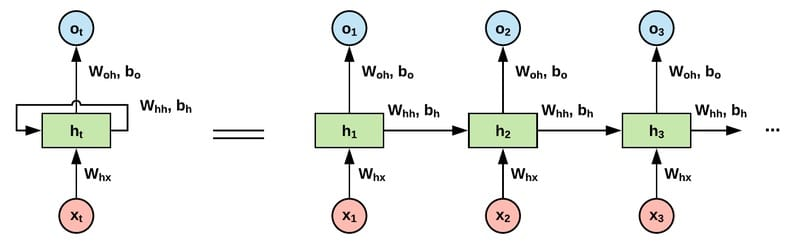
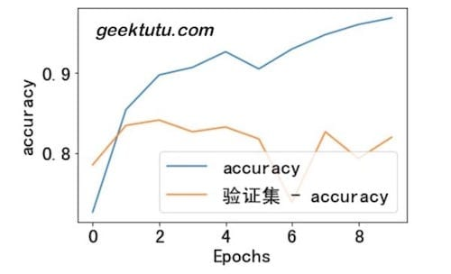
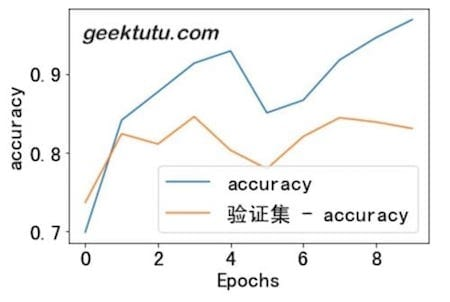

**TF2.0 TensorFlow 2 / 2.0 中文文档：RNN LSTM 文本分类 Text classification with an RNN**

主要内容：使用循环神经网络(Recurrent Neural Network, RNN) 分类 影评数据 IMDB

循环神经网络(Recurrent Neural Network, RNN)广泛适用于自然语言处理领域(Natural Language Processing, NLP)，RNN有什么显著的特点呢？普通的神经网络，每一层的输出是下一层的输入，每一层之间是相互独立的，没有关系。但是对于语言来说，一句话中的单词顺序不同，整个语义就完全变了。因此自然语言处理往往需要能够更好地处理序列信息的神经网络，RNN 能够满足这个需求。

RNN 中，隐藏层的状态，不仅取决于当前输入层的输出，还和上一步隐藏层的状态有关。



长短期记忆模型(Long short-term memory, LSTM)是一种特殊的RNN，主要是为了解决长序列训练过程中的梯度消失和梯度爆炸问题。简单来说，就是相比普通的RNN，LSTM能够在更长的序列中有更好的表现。

接下来我们使用`tf.keras`提供的 LSTM 网络层搭建 RNN 网络模型，对 IMDB 影评数据进行分类。

## 下载 IMDB

```python
# geektutu.com
import matplotlib.pyplot as plt
import tensorflow_datasets as tfds
import tensorflow as tf
from tensorflow.keras import Sequential, layers

ds, info = tfds.load('imdb_reviews/subwords8k', with_info=True,
                          as_supervised=True)
train_ds, test_ds = ds['train'], ds['test']

BUFFER_SIZE, BATCH_SIZE = 10000, 64
train_ds = train_ds.shuffle(BUFFER_SIZE)
train_ds = train_ds.padded_batch(BATCH_SIZE, train_ds.output_shapes)
test_ds = test_ds.padded_batch(BATCH_SIZE, test_ds.output_shapes)
```

## 文本预处理

通过 tfds 获取到的数据已经经过了文本预处理，即 Tokenizer，向量化文本(将文本转为数字序列)。

接下来我们看一看是如何转换的。

```python
# geektutu.com
tokenizer = info.features['text'].encoder
print ('词汇个数:', tokenizer.vocab_size)

sample_str = 'welcome to geektutu.com'
tokenized_str = tokenizer.encode(sample_str)
print ('向量化文本:', tokenized_str)

for ts in tokenized_str:
    print (ts, '-->', tokenizer.decode([ts]))
```

可以看到，有些单词被拆分了。因为 tokenizer 中不可能包含所有可能出现的单词，如果在 tokenizer 中没有的单词，就会被拆分。文本预处理有很多种方式，比如我们在[TensorFlow 2 中文文档 - IMDB 文本分类](https://geektutu.com/post/tf2doc-ml-basic-text.html)中使用了预训练好的字词嵌入模型 _google/tf2-preview/gnews-swivel-20dim/1_，来直接将影评文本转换为向量；还有非常出名的自然语言处理工具包 ntlk 在文本预处理环节提供了非常强大的功能。

```bash
词汇个数: 8185
向量化文本: [6351, 7961, 7, 703, 3108, 999, 999, 7975, 2449]
6351 --> welcome
7961 -->  
7 --> to 
703 --> ge
3108 --> ek
999 --> tu
999 --> tu
7975 --> .
2449 --> com
```

## 搭建 RNN 模型

借助`tf.keras`，我们可以非常方便地搭建出 LSTM 网络层，在这里我们只使用一层来试一试。

如果你比较细心地话，会发现在第一层使用了`tf.keras.layers.Embedding`，那为什么要使用这一层呢？从我们刚才的预处理实验你会发现，IMDB 数据集的预处理是按照单词在 tokenizer 中的下标来处理的，维度(tokenizer.vocab_size)很高也很稀疏，经过 Embedding 层的转换，将产生大小固定为64的向量。而且这个转换是可训练的，经过足够的训练之后，相似语义的句子将产生相似的向量。

我们在 LSTM 层外面套了一个壳(层封装器, layer wrappers): `tf.keras.layers.Bidirectional`，这是 RNN 的双向封装器，用于对序列进行前向和后向计算。

```python
# geektutu.com
model = Sequential([
    layers.Embedding(tokenizer.vocab_size, 64),
    layers.Bidirectional(layers.LSTM(64)),
    layers.Dense(64, activation='relu'),
    layers.Dense(1, activation='sigmoid')
])
model.compile(loss='binary_crossentropy', optimizer='adam',
              metrics=['accuracy'])
history1 = model.fit(train_ds, epochs=3, validation_data=test_ds)
loss, acc = model.evaluate(test_ds)
print('准确率:', acc) # 0.81039
```

最终达到了81%的准确率，我们使用 _matplotlib_ 把训练过程可视化吧。

```python
# geektutu.com
# 解决中文乱码问题
plt.rcParams['font.sans-serif'] = ['SimHei']
plt.rcParams['axes.unicode_minus'] = False
plt.rcParams['font.size'] = 20

def plot_graphs(history, name):
    plt.plot(history.history[name])
    plt.plot(history.history['验证集 - '+ name])
    plt.xlabel("Epochs")
    plt.ylabel(name)
    plt.legend([name, '验证集 - ' + name])
    plt.show()

plot_graphs(history1, 'accuracy')
```



## 添加更多 LSTM 层

```python
# geektutu.com
model = Sequential([
    layers.Embedding(tokenizer.vocab_size, 64),
    layers.Bidirectional(layers.LSTM(64, return_sequences=True)),
    layers.Bidirectional(layers.LSTM(32)),
    layers.Dense(64, activation='relu'),
    layers.Dense(1, activation='sigmoid')
])
model.compile(loss='binary_crossentropy', optimizer='adam',
              metrics=['accuracy'])
history = model.fit(train_ds, epochs=3, validation_data=test_ds)
loss, acc = model.evaluate(test_ds)
print('准确率:', acc) # 0.83096%
```

这一次，我们使用了2层 LSTM，正确率达到了83%。

```python
# geektutu.com
plot_graphs(history, 'accuracy')
```



返回[文档首页](https://geektutu.com/post/tf2doc.html)

> 完整代码：[Github - rnn-text.ipynb](https://github.com/geektutu/tensorflow2-docs-zh/tree/master/code)
> 参考文档：[Text classification with an RNN](https://www.tensorflow.org/beta/tutorials/text/text_classification_rnn)
